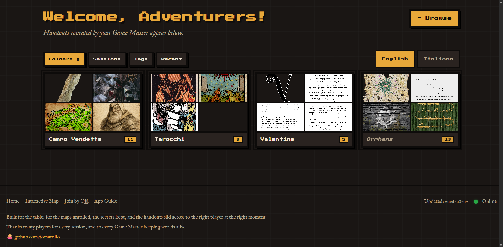
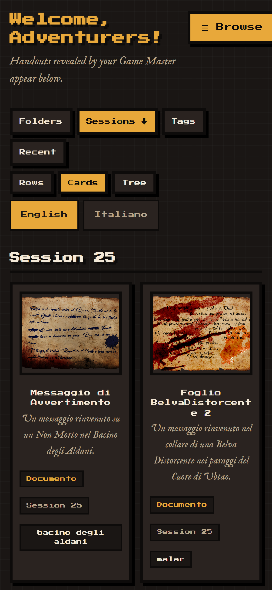
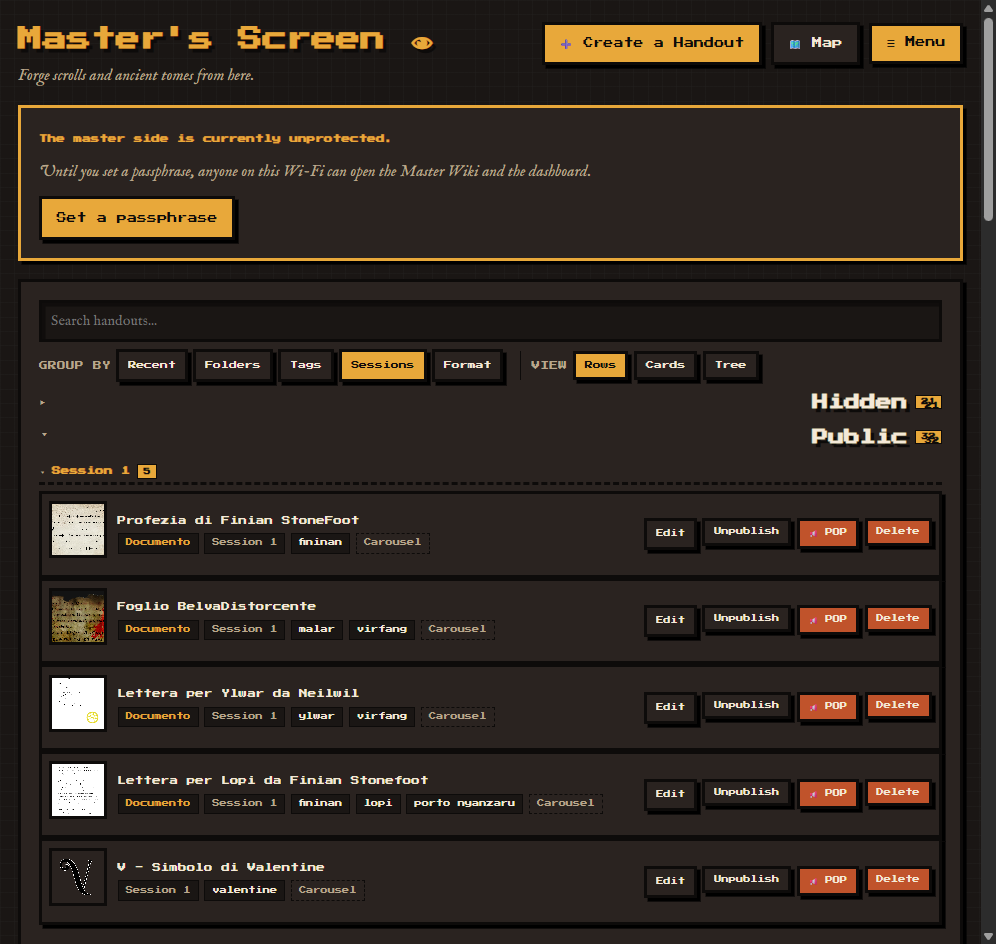
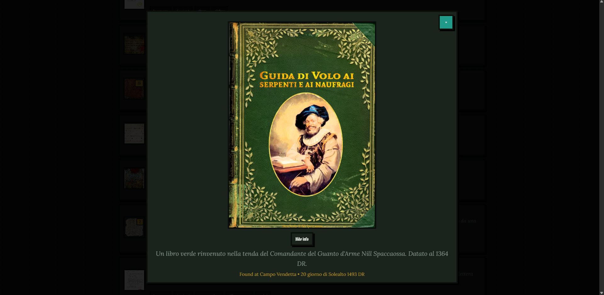
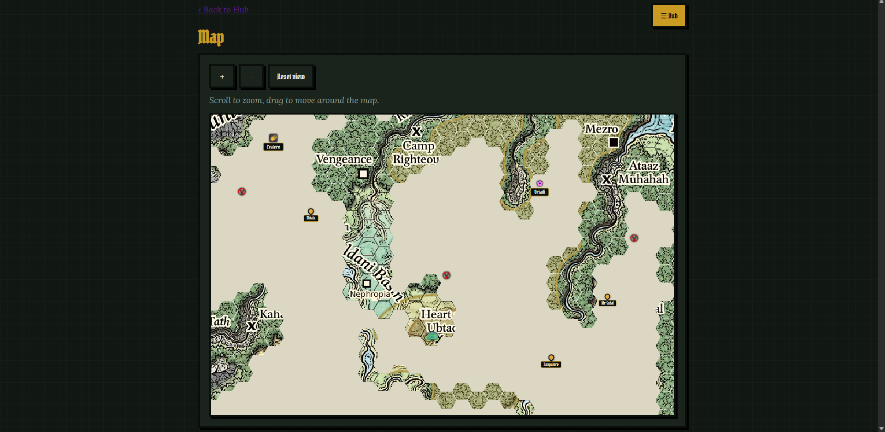
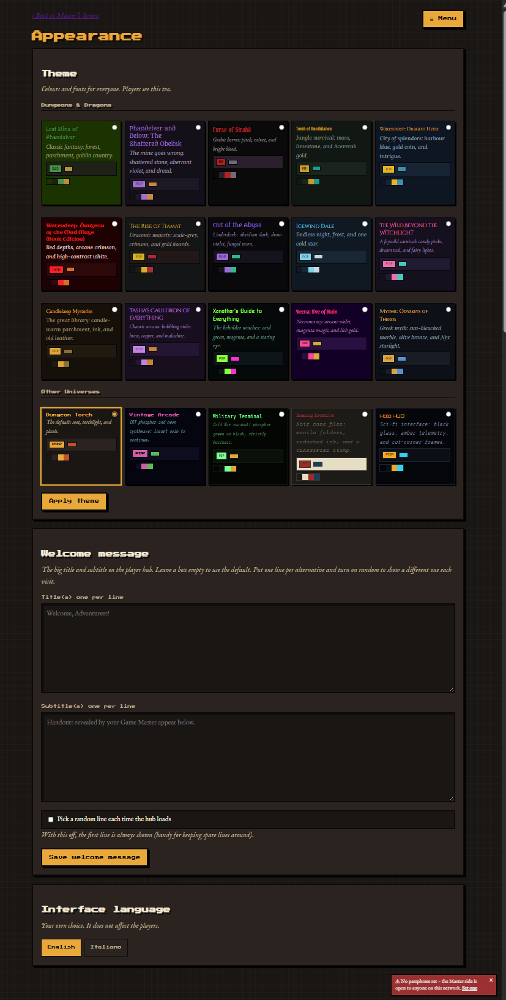
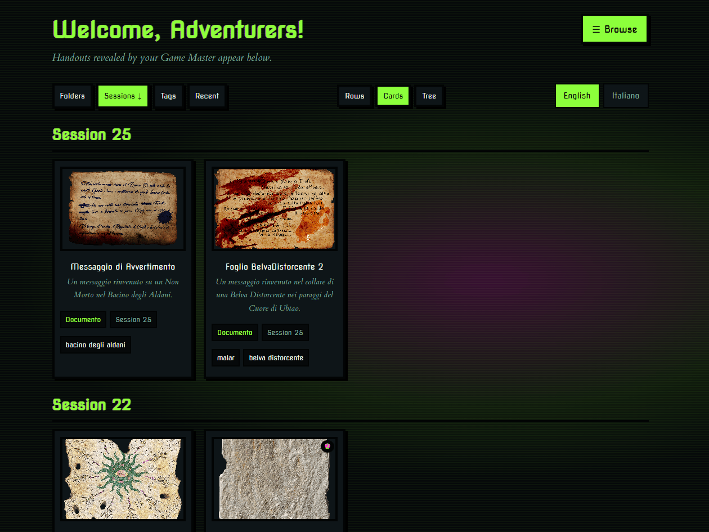

# Local Handouts Manager for Dungeons & Dragons

A lightweight, self-hosted web app for tabletop role-playing games. It lets a
Game Master share handouts, maps, lore documents and interactive books with the
players over a local Wi-Fi network, with no internet connection required.

Everything runs on your own machine. No cloud, no accounts, no lag.



> **New here?** Jump to the [Installation guide](INSTALL.md) for step-by-step
> setup on Windows, macOS and Linux (both a double-click launcher and the
> terminal).

---

## Table of contents

- [Features](#features)
- [Screenshots](#screenshots)
- [Quick start](#quick-start)
- [Themes](#themes)
- [Master access & security](#master-access--security)
- [How POP works](#how-pop-works)
- [Routes](#routes)
- [Project layout](#project-layout)
- [Roadmap](#roadmap)
- [Credits](#credits)

---

## Features

### For players

- **Zero setup.** Anyone on the same Wi-Fi opens the hub via a simple IP
  address on their phone, tablet or laptop. Nothing to install.
- **Browse however you think.** Handouts organised by collection, session or
  tag, plus a free-text search across titles, descriptions, tags and session
  notes.
- **Two readers.** A **Carousel** for images and PDFs, and a page-curling
  **Book** viewer for multi-page tomes, journals and grimoires (with an
  optional back cover).
- **Handouts that come to you.** When the Master POPs something, it opens on
  your screen by itself. If you are already reading a handout you are not
  interrupted: a banner offers the new one and you open it when you are ready.
- **A shared interactive map.** Follow the party's journey across a hex map the
  Master reveals as you go: fogged terrain, points of interest, a moving party
  marker, and a "look here" camera the Master can push to every screen.

### For the Game Master

- **Reveal mechanics.** Every handout starts hidden. Publish it and it appears
  on the players' hub, ready the next time they look.
- **POP Handout.** When you want the table looking *now*, POP it: the handout
  opens on every player's screen without anyone touching their phone. Use
  **POP** on anything already public, **Publish & POP** to reveal and pop in one
  click, or **Forge & POP** to do it straight from the upload form. Popping the
  same handout again re-opens it, for when half the table missed it.
- **Master's Screen.** Upload, edit, reorder pages by drag-and-drop, per-file
  descriptions, folders, tags, session numbers and discovery notes.
- **Interactive map control.** Upload a campaign map, calibrate a hex grid over
  it, reveal hexes as the party explores, drop labelled points of interest, and
  move the party marker. Your edits stay a private draft until you **confirm**
  them, so a stray click never flashes onto the table; a separate **focus**
  action pushes everyone's view to a spot on the map at once.
- **Theme manager.** Ten D&D campaign presets, each swapping the whole palette
  *and* both typefaces (see [Themes](#themes)).
- **Backup & Transfer.** Export the whole library - handouts, images, folders,
  and the interactive map (state *and* background image) - as a single `.zip`,
  and import it on another computer, with a review step so nothing is
  overwritten (or wiped) without your say-so.
- **Bilingual interface.** English and Italian, switchable per person. Each
  player can read the UI in their own language while you use another.

### Desktop launcher

A small **launcher** starts and stops the server from a window, so you never
touch a terminal at the table: Start/Stop with a live status light, your LAN
address shown ready to share, buttons that open the player, master and QR pages
in a browser, a language switch, a dark/light toggle, and a guarded
"reset master passphrase" button in case you forget it. See
[INSTALL.md](INSTALL.md#option-a-the-desktop-launcher-recommended).

---

## Screenshots

| Player hub | Master's Screen |
| --- | --- |
|  |  |

| A POP on a player's phone | The interactive map |
| --- | --- |
|  |  |

*(Screenshots live in [`docs/screenshots/`](docs/screenshots/))*

---

## Quick start

The short version (full, per-OS instructions are in **[INSTALL.md](INSTALL.md)**):

```bash
pip install -r requirements.txt
python app.py
```

Then open:

| Who | Where |
| --- | --- |
| Players | `http://localhost:8000` |
| Game Master | `http://localhost:8000/dm-panel` |

Other devices on the same Wi-Fi connect using your machine's local IP address,
e.g. `http://192.168.1.42:8000`. The launcher shows you that address; from the
terminal you can find it with `ipconfig` (Windows) or `ip addr` / `ifconfig`
(macOS/Linux).

For a session that runs for hours, prefer the launcher or a production server
(`waitress`) over `python app.py`; see [INSTALL.md](INSTALL.md#running-for-a-real-session).

---

## Themes

The theme is table-wide: the Master picks it and everyone sees it. Each preset
overrides the same design tokens, so switching can never leave a half-painted
UI. Two of them (Tasha and Xanathar) go further than colour and type, adding
their own animated textures - all motion respects `prefers-reduced-motion`.

| Theme | Mood |
| --- | --- |
| **Dungeon Torch** *(default)* | Soot, torchlight and pixels |
| **Lost Mine of Phandelver** | Forest, parchment, goblin country |
| **The Rise of Tiamat** | Scale-grey, crimson and gold hoards |
| **Out of the Abyss** | Obsidian dark, drow violet, fungal neon |
| **Tomb of Annihilation** | Jungle moss, limestone and Acererak gold |
| **Curse of Strahd** | Pitch, velvet and bright blood |
| **Icewind Dale** | Endless night, frost and one cold star |
| **Vecna: Eve of Ruin** | Grave-dark, corpse-light green and rotten violet |
| **Tasha's Cauldron of Everything** | A bubbling violet brew, copper and malachite |
| **Xanathar's Guide to Everything** | The watching beholder: acid green, magenta, a staring eye |





---

## Master access & security

The Master side is protected by a single passphrase - there are no user
accounts, because there is only ever one Master per table.

On first run the app is **unprotected** and says so on the dashboard. Open
**Menu -> Master Access** and set a passphrase before your first session; until
you do, anyone on the Wi-Fi can open the Master side. The passphrase is stored
as a salted hash, and unlocking sets a signed session cookie, so it cannot be
forged by editing the cookie. **Lock master mode** from the menu if you hand
your device to a player.

Under the hood the app also protects every state-changing action with a
per-session CSRF token, rate-limits the polling endpoints so a runaway client
cannot exhaust the server, and ships sensible response headers. The full
reasoning - threat model, the choices made, and their sources - is written up
in **[SECURITY.md](SECURITY.md)**.

> **Scope of the protection.** This is designed to stop a curious player at the
> table from reading your notes. The app speaks plain HTTP and is meant for a
> trusted home network; it is not hardened against an attacker on the LAN, and
> it should not be exposed to the public internet.

Optionally, set the session signing key yourself instead of letting the app
generate and store one:

```bash
# macOS / Linux
export HANDOUTS_SECRET_KEY="some-long-random-string"
# Windows (PowerShell)
$env:HANDOUTS_SECRET_KEY="some-long-random-string"
```

---

## How POP works

A POP is stored, not pushed. When you pop a handout, the Master routes record
`{seq, handout_id, at}` under `settings.pop` in the database, where `seq` is a
counter that only ever grows.

Every player's page polls `GET /api/pop` and compares the `seq` it gets back
against the last one that device showed (kept in `sessionStorage`). Anything
higher is a new POP, so the page opens it in the same lightbox a click would -
carousel, book, PDFs and back covers all work with no separate code path.
Polling pauses while a tab is hidden and fires immediately on return, so a phone
that was asleep catches up the moment it wakes.

Storing the POP rather than pushing it is what makes the late cases work: a
player who joins mid-session, reloads, or unlocks their phone still finds the
broadcast waiting. Only the newest POP is kept - popping a second handout
supersedes the first rather than queueing behind it. A POP also expires after a
couple of minutes, so a latecomer is not ambushed by a reveal the table finished
with long ago.

Two rules keep a POP from becoming a leak:

- A hidden handout cannot be popped (`400`). Popping is a spotlight, not a
  publish button.
- `/api/pop` re-checks `visible` on every read, and unpublishing or deleting a
  popped handout retires the broadcast. The endpoint is public by definition -
  players are never authenticated - so it never trusts the stored pointer alone.

Polling was chosen over Server-Sent Events or WebSockets deliberately: the app
runs a single lightweight server on a home network, where holding a long-lived
connection open per player costs more than it gains. A poll that fails is a poll
that simply happens again.

---

## Routes

| Route | Access | Purpose |
| --- | --- | --- |
| `/` | Players | The hub of revealed handouts |
| `/folder/<id>` | Players | A single collection |
| `/api/pop` | Players | Poll target: the current POP broadcast (JSON) |
| `/map` | Players | Read-only interactive map |
| `/api/map/state` | Players | Poll target: shared map state (JSON) |
| `/api/map/reveal.png` | Players | The revealed-only map composite |
| `/guide` | Public | The in-app guide |
| `/qr` | Public | A QR code that points at the player hub |
| `/unlock` | Public | Master passphrase prompt |
| `/dm-panel` | **Master** | Master's Screen |
| `/dm-panel/create` | **Master** | Upload form + folder management |
| `/pop/<id>` | **Master** | POP a public handout to every screen |
| `/publish/<id>` | **Master** | Publish a handout (`pop=1` to pop it too) |
| `/dm-panel/map` | **Master** | Interactive-map control |
| `/master/api/map/*` | **Master** | Map write endpoints (draft, confirm, focus) |
| `/dm-panel/appearance` | **Master** | Theme + language |
| `/dm-panel/transfer` | **Master** | Export / import |
| `/dm-panel/security` | **Master** | Set or change the passphrase |

Every **Master** route is enforced server-side. The player and master map
endpoints live in separate blueprints, so "players can read but never write" is
true by construction: there is simply no write handler in the player code path.

---

## Project layout

```
app.py                    # entry point: app factory, language + theme + role + CSRF/rate-limit
handouts/
  auth.py                 # master passphrase, session unlock, @master_required
  security.py             # CSRF token + rate limiting (stdlib only)
  storage.py              # JSON database + uploads on disk
  organize.py             # grouping, sorting and search (pure functions)
  theming.py              # the theme table: palettes, font pairs, per-theme CSS
  i18n.py                 # EN/IT catalogue
  pdfs.py                 # PDF -> images, thumbnails
  mapmask.py              # the revealed-only map composite (anti-spoiler)
  transfer.py             # export / import bundles (handouts + map + images)
  routes_player.py        # /            player hub, /api/pop, read-only map
  routes_master.py        # /dm-panel    master screen, settings, POP, map control
templates/
  master/  player/
  player/_lightbox.html   # the one viewer; exposes window.Lightbox
  player/_pop.html        # POP watcher: polls /api/pop, drives the lightbox
static/css/style.css      # mobile-first 8-bit stylesheet
launcher.py               # desktop GUI to start/stop the server
start_launcher.bat        # double-click entry point for the launcher (Windows)
INSTALL.md                # full install guide (Windows / macOS / Linux)
SECURITY.md               # threat model + security design writeup
```

---

## Roadmap

Planned, not yet available:

- **Dual Wiki.** A **Players Wiki** the table can read, and a **Master Wiki**
  for secrets and plot hooks, with a one-click "reveal to players" per page. The
  data model and transfer support already carry wiki pages along, but the
  browsing/editing UI is not wired up yet, so there are currently no wiki routes.

---

## Credits

The retro 8-bit visual style is inspired by [8bitcn/ui](https://8bitcn.com) by
[OrcDev](https://orcdev.com) (MIT-licensed). The look is reimplemented here in
plain CSS, with no React or Tailwind dependency.

Page-curl reading is powered by [StPageFlip](https://github.com/Nodlik/StPageFlip) (MIT).

Fonts are served from [Google Fonts](https://fonts.google.com/) (open-source
licenses).
